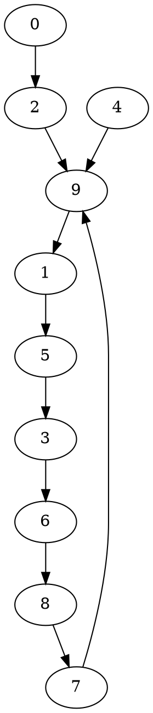

#leetcode 

Problem:

Given an array of integers `nums` containing `n + 1` integers where each integer is in the range `[1, n]` inclusive.

There is only **one repeated number** in `nums`, return _this repeated number_.

You must solve the problem **without** modifying the array `nums` and uses only constant extra space.

