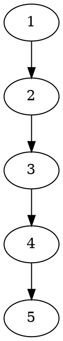

#DP #problem 

The problem states that we have n number of steps and we want to get to the top. However, at any given step, we must take either 1 or 2 steps while staying within the bounds of the steps.

Combinatorics problem: How many ways can we get to the top?

We can visualise this problem like a directed graph.





Then we can solve this by breaking the problem into smaller steps.

Instead of calculating the number of ways we can go from the ground to the top, how many ways can we get from 1 to 4?

Further breaking it down, we can ask how many ways can we get from 1 to 3?

Another time, 1 to 2?

Lastly, the base case 1 to 1?

The code for this is simple

```cpp
int countPaths(int steps) {
	int paths = 0;

	if (steps <= 2) {
		return steps;
	}

	paths += countPaths(steps - 1);
	paths += countPaths(steps - 2);

	return paths;
}
```


