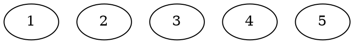

#DP #dsa 

>[!tip] Problem
>Write a function canSum(int, vector) that takes in a targetSum and an array of integers.
>
>Return a boolean indicating whether it is possible to generate the targetSum using numbers from the array.
>
>Assume that the elements can be used infinite number of times and all numbers are positive.

