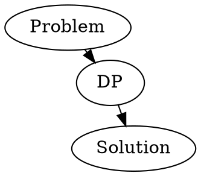
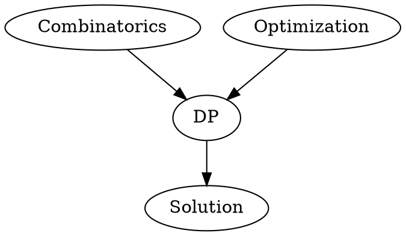

#DP

DP stands for Dynamic Programming.

#### What is a DP problem?
A problem must have one of two structures to be considered a problem solvable using DP.

1) Optimal Substructures
2) Overlapping Substructures

Optimal substructures split a problem space into exclusive sections where we can solve each substructure separately.

Overlapping substructures split a problem like an optimal substructure but with their bounds overlapping, which means that when we solve a substructure, we might be able to use the solution of another substructure in the current substructure's solution.

#### Types of DP problems
DP problems can be split into two categories.

1) Combinatorics : How many? (End Goal: Count something)
	- How many ways to make a change?
	- How many ways to traverse a graph?
	- How many steps needed to get from Point A to Point B?
1) Optimization : What is the minimum? maximum?
	- What is the minimum number of steps needed to get from Point A to Point B?
	- What is the maximum profit gained by buying and selling a stock?
	- What is the minimum cost to travel from New York to Mumbai?

#### Steps to solving a DP problem

1) Define objective function
2) Identify base cases
3) Recurrence Relation
4) Order of Computation

Recurrence relation is the relationship that allows us to transition or move from one sub-problem to another sub-problem.

Order of Computation is that we need to know in which order we need to solve our sub-problems.