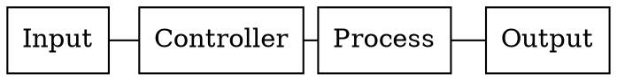
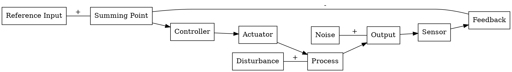

#enme585 #quiz2 #controlsystems #notes 

Open loop control system

```dot
digraph Open_Loop_Control_System {
    layout=neato;
    overlap=false;
    node [shape=rectangle];
    0 [label="Input"];
    1 [label="Controller"];
    2 [label="Process"];
    3 [label="Output"];
    0 -> 1 [dir=none];
    1 -> 2 [dir=none];
    2 -> 3 [dir=none];
    0 [pos="0,0!"];
    1 [pos="2,0!"];
    2 [pos="4,0!"];
    3 [pos="6,0!"];
}
```

Closed loop control system

```dot
digraph ClosedLoopControlSystem {
    overlap=false;
    node [shape=rectangle];
    0 [label="Reference Input"];
    1 [label="Summing Point"];
    2 [label="Controller"];
    3 [label="Actuator"];
    4 [label="Process"];
    5 [label="Sensor"];
    6 [label="Feedback"];
    7 [label="Output"];
    8 [label="Disturbance"];
    9 [label="Noise"];
    0 -> 1 [label="+", dir=none];
    6 -> 1 [label="-", dir=none];
    1 -> 2;
    2 -> 3;
    3 -> 4;
    4 -> 7;
    7 -> 5;
    5 -> 6;
    8 -> 4 [label="+", dir=none];
    9 -> 7 [label="+", dir=none];
    rankdir=LR;
}

```

